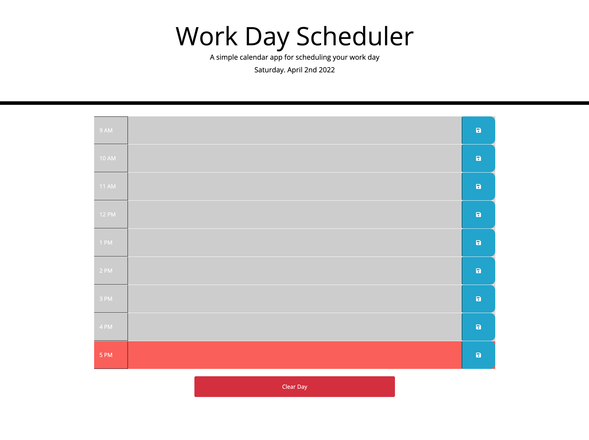

# Work Day Schedule

## Page summary

- User can click on time of the day and add a task
- Page reloads to show colors which are telling user if the tast is past due, upcoming, or currently do.
- User can save the tasks which are being added to the local storage

## Repo Url

- https://rpliszka1987.github.io/work-day-schedule/

## Page Image

